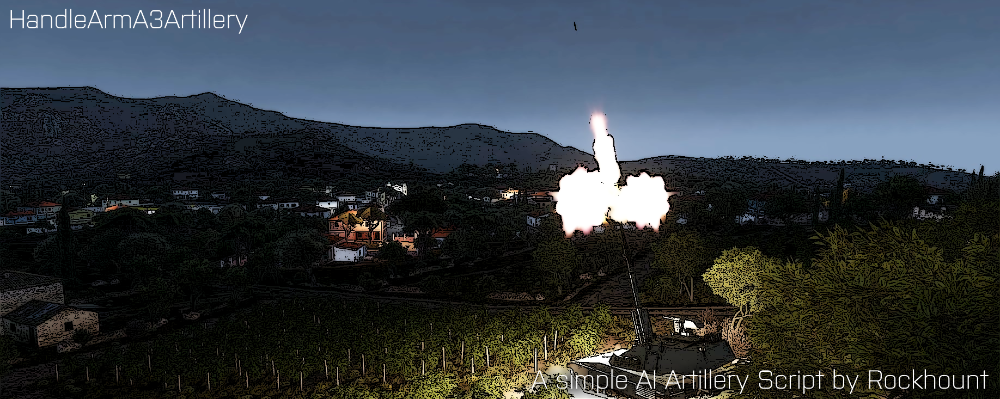

# ArmA 3 Script HandleArmA3Artillery

  

# Support
There will be no official support.

# Pull Requests
Official-Code will remain as it is, but you are free to change it for your purposes.

## Content
It is a single ~100Code-Line-Big Script to let an AI controlled artillery shoot at a single destination.

## Purpose
The aim of this script is to make it easier to implement an artillery.

## Story
This is a script that I wrote years ago for a event mission. It's supposed to simplify the command to an AI for shooting at an specified area with the artillery. There are several routine integrated to avoid script errors. A description can be found inside the SQF file, how to execute the script. It's SP/MP/Dedicated and HC compatible. Have fun.

## Media

### Showcase #1 (Clip)
